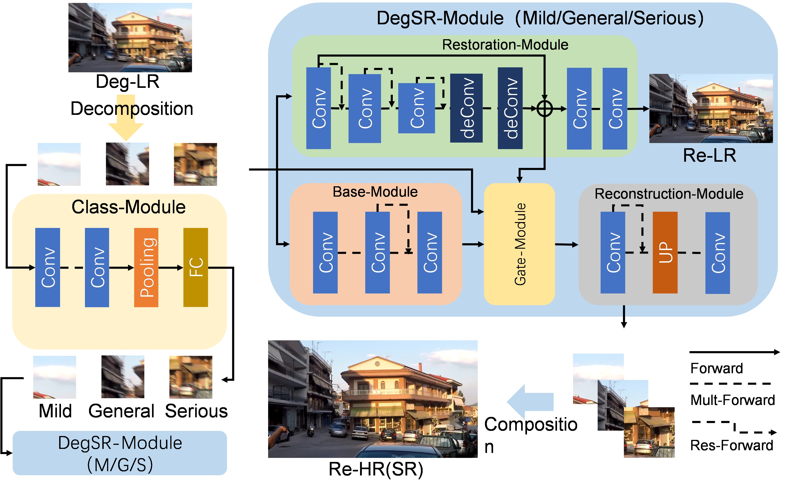

#ClassDegSR
---
ClassDegSR: A Fast Network for Degraded Image Super Resolution Based on Degrade Degree Classification

##Dependencies
+ Python 3.6
+ PyTorch >= 1.7.0
+ matplotlib
+ opencv
+ torchvision
+ numpy
+ skimage
+ lmdb

##Dataset
1. Download the datasets([GoPro](https://seungjunnah.github.io/Datasets/gopro)).
2. Extract sub images(/dataset/extract_subimages.py)

    	root_folder = "PATH to train/test"
    	save_xx_subs_folder = "PATH to save train/test_HR/deHR/LR/deLR_subs"

3. Calculate PSNR between LR_subs and deLR_subs for classification(/dataset/calculate_PSNR_SSIM.py)

	    folder_GT = "PATH to LR_subs"
	    folder_Gen = "PATH to deLR_subs"
	    test_Y = True/False  # True: test Y channel only; False: test RGB channels

4. Divide sub images(/dataset/divide_subimages.py)
	
	    source_list = "PATH to HR/deHR/LR/deLR_subs"
		target_list = "PATH to save Classification results class1/class2/class3"
	    threshold = [23.6624,28.5995]

## Train
### 1. Pre-trian DegSR-Module
Base on [GFN](https://github.com/BookerDeWitt/GFN-IJCV).

    python ./codes/train_GFN.py --root Train_PATH --type none/class1/2/3 --resume Checkpoint_PATH

### 2. Pre-trian Class-Module

    python ./codes/train_Class.py --train_root Train_PATH --test_root Test_PATH --resume Checkpoint_PATH

### 3. Trian ClssDegSR

#####with pretrain Class
    python ./codes/train_DegSR.py --root Train_PATH --gnf_s Pretrained_branch1_PATH --gnf_m Pretrained_branch2_PATH --gnf_l Pretrained_branch3_PATH --classifier Pretrained_classifier_PATH --resume Checkpoint_PATH

#####without pretrain Class （skip 2. Pre-trian Class-Module）
	pyhton ./codes/train_DegSR_o.py --root Train_PATH --gnf_s Pretrained_branch1_PATH --gnf_m Pretrained_branch2_PATH --gnf_l Pretrained_branch3_PATH --resume Checkpoint_PATH

## Test
###1. Test DegSR-Module
    python ./codes/test_GFN.py --dataset Test_PATH --intermediate_process Model_PATH
###2. Test Class-Module
    python ./codes/test_Class.py --model Model_PATH --root Test_PATH --part [True：Test Class_Module in DegSR model / False:Test pretrained Class_Module]
###3. Test ClassDegSR
    pythoh ./codes/test_ClassDegSR --model ClassDegSR_PATH --gnf_s Pretrained_branch1_PATH --gnf_m Pretrained_branch2_PATH --gnf_l Pretrained_branch3_PATH --classifier Pretrained_classifier_PATH --root Test_PATH --save_SR Save_SR_PATH --save_deLR Save_deLR_PATH --joint [True：Test DegSR model / False:Test just pretrained Modules]